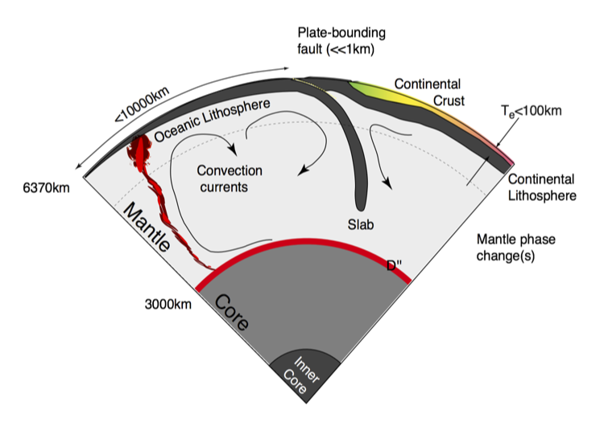

<!-- TOC / Menu -->


<!-- <figure id="mundus">

<figcaption>
Athanasius Kircher, Mundus subterraneus (1664/65): Systema Ideale PYROPHYLACIORUM Subterraneorum, quorum montes <i> Vulcanii, veluti spiracula quaedam existant </i>
</figcaption>
</figure> -->

\\[
\require{color}
\newcommand{\dGamma}{\mathbf{d}\boldsymbol{\Gamma}}
\newcommand{\erfc}{\mbox{\rm erfc}}
\newcommand{\Red}[1]{\textcolor[rgb]{0.7,0.0,0.0}{#1}}
\newcommand{\Green}[1]{\textcolor[rgb]{0.0,0.7,0.0}{ #1}}
\newcommand{\Blue}[1]{\textcolor[rgb]{0.0,0.0,0.7}{ #1}}
\newcommand{\Emerald}[1]{\textcolor[rgb]{0.0,0.7,0.3}{ #1}}
\\]

---

## Introduction

Our goal is to develop an quantitative understanding of the dynamic processes within the Earth and sister planets as I have sketched in the Figure to the right. These dynamic processes are largely driven by the internal heat of the planet escaping to the surface through whatever mechanisms are available. Some of the heat is left over from the original formation of the planet, and the rest originates in the decay of radioactive elements. In the Earth's early history and elsewhere in the solar system, tidal heating, chemical segregation, and impacts have all played a role in supplying the interior heat budget. The [figure below](#earth-interior) is a schematic of the Earth's interior and something similar for Venus and Mars would be, on the face of it, much simpler.

<figure>
	
	<figcaption>
	A schematic of the interior of the Earth showing some of the global scale processes we seek to understand quantitatively in this course
	</figcaption>
</figure>

This is because the dynamics of the Earth is completely dominated by Plate Tectonics - a unique manifestation of interior heat loss as far as we are aware. Part of our task is to understand why plate tectonics is a possible outcome of a hot planet, but also why it is not the only possible outcome. If we can also understand how the different modes are selected for planets of different size, composition, and heat budget, then we have a powerful way to predict the geological behaviour of extrasolar planets. Plate tectonics creates a number of very efficient cycling mechanisms which link the interior of the Earth and the Atmosphere and Oceans; it may prove to be an essential ingredient for the kind of friendly world we expect to be needed to nurture (intelligent) life.

## Modeling

Global scale geodynamics is a discipline where we cannot do controlled experiments on the basic processes we are studying. We rely on observing the Earth and the other terrestrial planets and moons and looking for multiple manifestations of the same processes under different conditions to give us control on certain parameters.

While it is not possible to do experiments at the planetary scale over geological time, it is possible to perform experiments at a physically manageable size and, by careful scaling, to generalise the results to geologically relevant space and time-scales. If these processes of interest can be understood through a mathematical description, then the equations are automatically applicable at geological time and space scales provided the assumptions which go into developing the mathematical model are still valid.

We will frequently be talking about "modeling" --- people mean many different things by this and all of the following fall under the general concept of modeling:

* Laboratory based physical models which can be scaled to give meaningful, quantitative insight into deformation at geological scales.
* The building of mathematical descriptions of the world and their use to approximate physical "reality".
* Computational solution of these descriptions (where needed) and
the concept of a numerical model (we deal with the extensively later)
* How to go about constructing a model
* How to go about using a model (these are quite different things !).
* Exploring parameter variation to understand the dominant effects.

## Mathematical background

These notes contains material at different levels. There is broadly descriptive content which is intended to introduce the subject and lead up to the more advanced mathematical content. It should be possible to follow these notes without detailed knowledge of how the mathematical results are obtained, but it is expected that you can use the results in exercises for to solve real problems in geophysics.

Familiarity with vectors and tensors notation together with the index notation is assumed for understanding the equations and I interchange the different notations where the result is clearer or more memorable. On the assumption that these things are disconcerting (at best) the first few times, I will write everything out in full -- at least for the Cartesian case. In other geometries, vector notation generally still holds, but the definition of the operators can be very different, and it is always worth checking before using them.

---

## Reading Material

G. F. Davies.
Dynamic Earth.
Cambridge University Press,
New York, 1999.

J. Grotzinger, T. H. Jordan, F. Press, and R. Siever.
Understanding Earth.
W. H. Freeman & Co, 5 edition, 2006.
[link](http://bcs.whfreeman.com/understandingearth5e/).

L. D. Landau and E. M. Lifshitz.
Fluid Mechanics, volume 6 of Course of Theoretical Physics.
Pergamon Press, 1959.

G. Schubert, D. L. Turcotte, and P. Olson.
Mantle Convection in Earth and Planets.
Cambridge University Press, UK, 2001.

D.L. Turcotte and G. Schubert.
Geodynamics.
John Wiley and Sons, New York, 1982.
